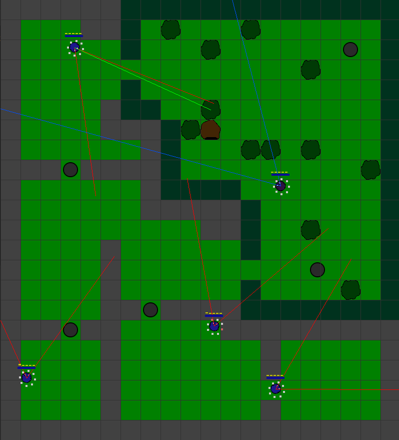
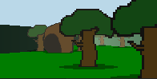
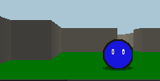

# Meep_Playground_Python

## Concept
This is the first version of a reinforcement learning AI playground. Later versions have been ported to Unity and are written in C#.
A level can be created by painting a map where every pixel color means another object. An example and the meaning of colors can be found in the folder "worlds".
A world contains different Meeps (lifeforms) currently moving randomly through the map. They are capable of moving, eating, replacing obstacles like rocks and attacking each other.
The lose energy over time and with every action they perform. When the energy drops to 0 they die and become eadible meat.
The Meeps are capable of sensing the direction of a touch, a simplified concept of sound, pain and their energy level representing hunger.
Two types of vision are implemented:
- A vector containing the rotation and distance of other objects.
- A custom raycasting algorithm allowing for a simulated 3D environment.
Meeps can be carnivore and eat other Meeps, herbivore and eat only fruits, or omnivore.
The environment has a day-night cycle of a few minutes and there are fruit trees growing fruits after a time.

## Controls
If one controllable Meep is set, this one can be controlled with the keyboard.
- w = move forward
- s = move backward
- d = turn right
- a = turn left
- c = carry a rock
- f = attack and eat
- q = Shout on frequency 3
- e = Shout on frequency 4

## Screenshots
### Image of the existing testmap

### Images of raycasting vision

